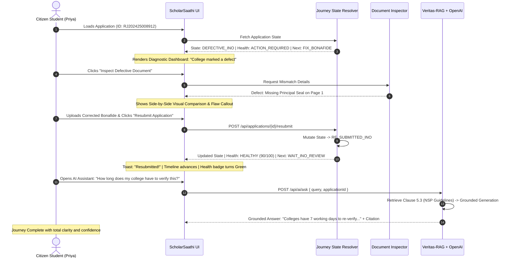

# ScholarSaathi — Hackathon MVP Technical Specification & Architecture Contract
**Document Version:** 1.0.0-MVP-SPEC  
**Hackathon:** Build What Moves India (2026)  
**Track:** Citizen Guidance & Public Digital Services  
**Role:** Senior Solution Architect & Technical Lead Specification  
**Status:** Approved Implementation Contract (Ready for Codex & Antigravity)

---

## 1. Purpose
This document provides the definitive, production-quality technical blueprint for implementing the **Hackathon MVP Vertical Slice** of **ScholarSaathi**. It defines the exact system architecture, deterministic journey state machine, typed API contracts, data models, AI grounding boundaries (Veritas-RAG + OpenAI), and implementation responsibilities. 

This specification is designed to be executed directly by **Codex** (AI/RAG/Backend Foundation) and **Antigravity** (Full-Stack UI/Integration), followed by a final **Codex QA/Hardening** pass.

---

## 2. Relationship to PRD, PPD, and PRODUCT_BLUEPRINT
- [PRD.md](file:///d:/ScholarSaathi/PRD.md), [PPD.md](file:///d:/ScholarSaathi/PPD.md), and [PRODUCT_BLUEPRINT.md](file:///d:/ScholarSaathi/PRODUCT_BLUEPRINT.md) remain the authoritative, non-negotiable **Production-Grade Product Definition**. They define the full multi-state, multi-scheme, multi-lingual vision of ScholarSaathi.
- **`HACKATHON_MVP_TECHNICAL_SPEC.md`** (this document) defines the **isolated vertical slice** engineered specifically for the 5-day "Build What Moves India" hackathon deadline.
- **Architectural Continuity Rule:** The MVP architecture is **not** a throwaway mock. Every module, interface, and data model implemented in the MVP is designed as a direct subset of the production architecture, allowing seamless post-hackathon scaling without rewrites.

---

## 3. Production vs. Hackathon MVP Distinction

| Dimension | Full Production Product ([PRODUCT_BLUEPRINT.md](file:///d:/ScholarSaathi/PRODUCT_BLUEPRINT.md)) | Hackathon MVP Vertical Slice (This Spec) |
| :--- | :--- | :--- |
| **Citizen Scope** | Multi-scheme (Central, Post-Matric, MCM, State), all Indian states. | Single focused scheme: **Post-Matric Scholarship for Higher Education (Central/State Model)**. |
| **Language** | Full bilingual & multi-vernacular (EN, HI, TE, TA, BN, MR). | **English with plain-language Indian context** (Hindi terminology where vital). |
| **Journeys Supported**| 15 full workflows (Defects, Stalls, Rejections, NPCI, Escalations). | **1 Primary Golden Journey (Defect $\rightarrow$ Diagnosis $\rightarrow$ Correction $\rightarrow$ Resubmit $\rightarrow$ Grounded AI)** + 1 Secondary Baseline Journey. |
| **Banking / DBT** | Full NPCI Mapper simulation, mandate generation, UTR reconciliation. | Deferred to post-hackathon (diagnostic state modeled in schema, UI focused on document defect). |
| **Backend Storage** | Persistent relational DB (PostgreSQL) + Vector DB (Pinecone/pgvector). | High-performance in-memory state store with typed file persistence / SQLite + in-memory vector embeddings. |
| **AI Subsystem** | Multi-agent policy reflection, autonomous multi-turn clarification. | **Veritas-RAG single-turn grounded retrieval + OpenAI answer synthesis + source citations**. |

---

## 4. Hackathon MVP Scope (P0 — Strictly Implemented)
1. **Synthetic Demo Student & Application Store:** Instant loading of structured synthetic citizen applications.
2. **Deterministic Journey State Model:** Single authoritative state engine driving Health, Status Explanation, and Next Action.
3. **Application Diagnostic Dashboard:** Citizen-first responsive view rendering status, health, and current milestone.
4. **4-Tier Verification Timeline:** Visual tracking across Institute (INO) $\rightarrow$ District (DNO) $\rightarrow$ State (SNO) $\rightarrow$ PFMS/Disbursement.
5. **Plain-Language Status Translator:** Converts raw bureaucratic statuses into empathetic, de-jargonized explanations.
6. **Next Action Engine (Single Hero Card):** Unambiguous determination of the single highest-priority next step.
7. **Document Mismatch Inspector:** Interactive side-by-side inspection of synthetic flawed document (Missing College Seal) vs. valid standard.
8. **Guided Correction & Resubmission Simulator:** Upload replacement simulation, real-time backend state mutation to `RE_SUBMITTED_INO`.
9. **Dynamic Health Indicator:** Deterministic categorical state (`HEALTHY`, `ATTENTION_REQUIRED`, `ACTION_REQUIRED`).
10. **Grounded AI Citizen Assistant (Veritas-RAG + OpenAI):** Policy-grounded Q&A with strict scheme clause citations and zero hallucinations.
11. **Safety, Privacy & Ethical Disclaimers:** Persistent non-government simulation notices and synthetic data disclosures.
12. **Complete Citizen Golden Journey:** End-to-end execution without dead ends, page reloads, or broken states.

---

## 5. Explicitly Deferred Scope (Post-Hackathon Roadmap)
- *Deferred:* Live integration or scraping of `scholarships.gov.in`, PFMS, or UIDAI portals.
- *Deferred:* Multi-language toggles (Hindi/vernacular UI translation packs).
- *Deferred:* NPCI bank mandate form generator modal and direct branch letter generation.
- *Deferred:* Formal SLA breach CPGRAMS grievance memo export.
- *Deferred:* Multi-file PDF parsing with OCR / computer vision models.
- *Deferred:* DigiLocker OAuth sandbox integration.
- *Deferred:* Voice input/output audio accessibility modules.

---

## 6. The Hackathon Golden Citizen Journey



---

## 7. System Architecture

```
+---------------------------------------------------------------------------------------------------+
|                                      CITIZEN PRESENTATION LAYER                                   |
|  +---------------------------------------------------------------------------------------------+  |
|  |  Next.js 14+ / React (App Router, Tailwind CSS, Lucide Icons, Accessible Radix Primitives)   |  |
|  |  - Responsive Mobile-First Shell (360px+ Viewport Support)                                  |  |
|  |  - State-Driven Dashboard (Status Card, Health Badge, Next Action Hero Card, Timeline)     |  |
|  |  - Interactive Document Mismatch Inspector & Resubmission Modal                             |  |
|  |  - Veritas-RAG Grounded AI Chat Drawer                                                      |  |
|  +---------------------------------------------------------------------------------------------+  |
+---------------------------------------------------------------------------------------------------+
                                                  | JSON / HTTP REST
+-------------------------------------------------v-------------------------------------------------+
|                                     SCHOLARSAATHI BACKEND CORE                                    |
|  +---------------------------------------------------------------------------------------------+  |
|  |  API Routing & Controller Layer (Next.js Route Handlers / Express Core)                     |  |
|  |  - GET  /api/applications/:id             - POST /api/applications/:id/resubmit            |  |
|  |  - GET  /api/applications/:id/document   - POST /api/ai/ask                                 |  |
|  +---------------------------------------------------------------------------------------------+  |
|                                                  |                                                |
|  +-----------------------------------------------v---------------------------------------------+  |
|  |  DETERMINISTIC APPLICATION DOMAIN (Source of Truth)                                         |  |
|  |  +----------------------------------+  +-------------------------------------------------+  |  |
|  |  | Application State Machine        |  | Journey State Resolver                          |  |  |
|  |  | - Strict transition guards       |  | - Derives Status Translation, Next Action &     |  |  |
|  |  | - Mutation operations (Resubmit) |  |   Health Indicator deterministically            |  |  |
|  |  +----------------------------------+  +-------------------------------------------------+  |  |
|  |  +---------------------------------------------------------------------------------------+  |  |
|  |  | In-Memory Synthetic Data Store (Pre-seeded with 2 realistic student profiles)          |  |  |
|  |  +---------------------------------------------------------------------------------------+  |  |
|  +---------------------------------------------------------------------------------------------+  |
|                                                  |                                                |
|  +-----------------------------------------------v---------------------------------------------+  |
|  |  AI & KNOWLEDGE SUBSYSTEM (Veritas-RAG + OpenAI Engine)                                     |  |
|  |  +---------------------------------------------------------------------------------------+  |  |
|  |  | Hybrid Policy Retrieval Engine (Indexed Official NSP & State Scheme Guidelines)        |  |  |
|  |  | - Top-k semantic chunk matching + keyword filtering                                  |  |  |
|  |  +---------------------------------------------------------------------------------------+  |  |
|  |  | Grounded Synthesis & Guardrail Module (OpenAI API - gpt-4o / gpt-4o-mini)                |  |  |
|  |  | - Enforces strict policy grounding, source citations, and hallucination rejection      |  |  |
|  |  +---------------------------------------------------------------------------------------+  |  |
|  +---------------------------------------------------------------------------------------------+  |
+---------------------------------------------------------------------------------------------------+
```

---

## 8. Component Architecture (Frontend & Backend Boundaries)

### Frontend Components (`src/components/`)
- `DashboardShell`: Main mobile-first grid container with non-government disclaimer banner.
- `PersonaSwitcher`: Dropdown allowing instant toggle between Demo Persona 1 (Defective) and Demo Persona 2 (Approved/Sanctioned).
- `StatusTranslationCard`: Empathetic card displaying plain-language meaning, "Is my money safe?", and current authority.
- `HealthBadge`: Categorical health chip (`ACTION_REQUIRED`, `HEALTHY`, `ATTENTION_REQUIRED`).
- `JourneyTimeline`: Visual horizontal/vertical 4-milestone stepper (College $\rightarrow$ District $\rightarrow$ State $\rightarrow$ PFMS).
- `NextActionHero`: High-visibility callout rendering the single required action with direct CTA button.
- `DocumentMismatchModal`: Interactive modal showing side-by-side comparison of the missing seal defect with upload replacement trigger.
- `GroundedAIChatDrawer`: Slide-over conversational assistant with suggested query chips, cited answer cards, and confidence badges.

### Backend Core Modules (`src/server/` or `src/lib/`)
- `stateMachine.ts`: Authoritative state transitions and mutation validation.
- `journeyResolver.ts`: Derives translation text, health status, and next action from application state.
- `syntheticStore.ts`: In-memory storage repository holding student profiles, applications, and documents.
- `rag/retriever.ts`: Hybrid search over curated scholarship knowledge chunks.
- `rag/groundingEngine.ts`: Prompts OpenAI with context chunks, verifies citations, and enforces safety bounds.

---

## 9. Backend Architecture
The backend is organized into three clean decoupled layers:
1. **Controllers / Route Handlers:** Validate request payloads, invoke domain services, and return typed JSON envelopes.
2. **Domain State Engine:** Pure business logic containing state transition rules, SLA calculations, and document defect definitions.
3. **AI / Veritas-RAG Service:** Isolated service accepting natural language queries, retrieving policy context, and generating validated answers.

---

## 10. Frontend Architecture
- **State Management:** Lightweight React state + SWR / React Query for asynchronous API polling and optimistic UI updates upon resubmission.
- **Styling & Design System:** Tailwind CSS with custom Indian Civic Palette (Deep Navy `#0F2854`, Warm Saffron `#E67E22`, Emerald `#10B981`, Slate Background `#F8FAFC`).
- **Responsive Layout:** CSS Grid & Flexbox optimized for 360px–430px mobile viewports, expanding gracefully to desktop.

---

## 11. Authoritative Journey State Model

The **Journey State Resolver** is the single source of truth that converts raw application states into citizen-facing attributes:

```
                          [Raw Application State]
                                     |
                         [Journey State Resolver]
                                     |
         +---------------------------+---------------------------+
         |                           |                           |
         v                           v                           v
  [Health Category]         [Status Translation]         [Next Action Key]
  - HEALTHY                 - Plain Title (EN)           - Action Title
  - ACTION_REQUIRED         - Empathetic Explanation     - Target Action Type
  - ATTENTION_REQUIRED      - Money Reassurance Flag     - CTA Button Label
```

---

## 12. State Machine

### MVP Application States
1. `DRAFT`: Form initiated, not submitted.
2. `SUBMITTED`: Submitted by student, awaiting initial intake.
3. `INSTITUTE_VERIFICATION`: Application pending at College Nodal Officer (INO) desk.
4. `DEFECTIVE_INSTITUTE`: College Nodal Officer flagged a correctable document error.
5. `RE_SUBMITTED_INSTITUTE`: Student corrected and re-uploaded document; re-queued for INO review.
6. `DISTRICT_VERIFICATION`: College approved; pending at District Nodal Officer (DNO).
7. `STATE_VERIFICATION`: District approved; pending at State Nodal Officer (SNO).
8. `DISBURSED`: Sanctioned and successfully credited via DBT.

---

## 13. Valid State Transitions Matrix

| Current State | Trigger Event | Next State | Guard / Condition |
| :--- | :--- | :--- | :--- |
| `DRAFT` | `SUBMIT_APPLICATION` | `SUBMITTED` | All mandatory documents attached. |
| `SUBMITTED` | `QUEUE_FOR_INO` | `INSTITUTE_VERIFICATION` | System automated routing. |
| `INSTITUTE_VERIFICATION` | `FLAG_DEFECT` | `DEFECTIVE_INSTITUTE` | INO identifies missing seal/signature. |
| `DEFECTIVE_INSTITUTE` | `RESUBMIT_CORRECTION` | `RE_SUBMITTED_INSTITUTE` | Valid synthetic document attached + checklist confirmed. |
| `RE_SUBMITTED_INSTITUTE` | `APPROVE_INO` | `DISTRICT_VERIFICATION` | INO re-review passed. |
| `DISTRICT_VERIFICATION` | `APPROVE_DNO` | `STATE_VERIFICATION` | DNO quota and certificate verified. |
| `STATE_VERIFICATION` | `SANCTION_AND_PAY` | `DISBURSED` | SNO approval & PFMS DBT release. |

---

## 14. Data Model (TypeScript Definitions)

```typescript
// ============================================================================
// Core Enums
// ============================================================================
export type ApplicationState = 
  | "DRAFT"
  | "SUBMITTED"
  | "INSTITUTE_VERIFICATION"
  | "DEFECTIVE_INSTITUTE"
  | "RE_SUBMITTED_INSTITUTE"
  | "DISTRICT_VERIFICATION"
  | "STATE_VERIFICATION"
  | "DISBURSED";

export type HealthCategory = "HEALTHY" | "ATTENTION_REQUIRED" | "ACTION_REQUIRED";

export type DeskAuthority = "COLLEGE_INO" | "DISTRICT_DNO" | "STATE_SNO" | "PFMS_DBT" | "COMPLETED";

export type DocumentType = "BONAFIDE_CERTIFICATE" | "INCOME_CERTIFICATE" | "PREVIOUS_MARKSHEET" | "FEE_RECEIPT";

// ============================================================================
// Database Entities
// ============================================================================

export interface Student {
  id: string; // "STUDENT_001"
  name: string; // "Priya Sharma"
  category: "OBC" | "SC" | "ST" | "GENERAL_EWS";
  stateOfDomicile: string; // "Rajasthan"
  institutionName: string; // "Govt. Degree College, Alwar"
  courseName: string; // "B.Sc. Mathematics (Year 2)"
  rollNumber: string; // "ALW-2023-BSC-089"
  maskedAadhaar: string; // "XXXX-XXXX-4819"
  maskedBankAccount: string; // "SBI - XXXX8912"
}

export interface ApplicationDefect {
  id: string; // "DEF_001"
  documentId: string; // "DOC_BONAFIDE_001"
  documentType: DocumentType;
  officialCode: string; // "INO_REJ_SEAL_MISSING"
  officialReason: string; // "Institution Seal / Principal Signature Missing"
  plainExplanation: string; // "Your college clerk noted that the uploaded Bonafide Certificate does not have the official round stamp of the Principal."
  correctionInstructions: string; // "Get the Bonafide stamped by the College Admin Office and re-upload."
  isResolved: boolean;
  flaggedAt: string; // ISO Timestamp
  resolvedAt?: string; // ISO Timestamp
}

export interface ApplicationDocument {
  id: string; // "DOC_BONAFIDE_001"
  applicationId: string;
  type: DocumentType;
  fileName: string; // "Bonafide_Certificate_Priya.pdf"
  fileUrl: string; // Synthetic preview URL
  uploadDate: string;
  isDefective: boolean;
  defectDetails?: ApplicationDefect;
}

export interface StatusHistoryEntry {
  id: string;
  state: ApplicationState;
  desk: DeskAuthority;
  title: string;
  description: string;
  timestamp: string; // ISO Timestamp
  isCompleted: boolean;
}

export interface ScholarshipApplication {
  id: string; // "RJ202425008912"
  studentId: string;
  schemeName: string; // "Post-Matric Scholarship Scheme for OBC Students"
  academicYear: string; // "2024-2025"
  submissionDate: string;
  lastUpdated: string;
  currentState: ApplicationState;
  currentDesk: DeskAuthority;
  daysAtCurrentDesk: number;
  slaMaxDays: number;
  defects: ApplicationDefect[];
  documents: ApplicationDocument[];
  timeline: StatusHistoryEntry[];
}

export interface JourneyResolvedState {
  applicationId: string;
  currentState: ApplicationState;
  currentDesk: DeskAuthority;
  healthCategory: HealthCategory;
  healthScore: number; // 0 - 100
  statusTitle: string;
  statusExplanation: string;
  moneyReassurance: string;
  isActionRequired: boolean;
  nextAction: {
    actionType: "FIX_DEFECT_BONAFIDE" | "WAIT_VERIFICATION" | "NONE";
    title: string;
    description: string;
    ctaLabel: string;
    deadlineDaysRemaining?: number;
  };
}

export interface KnowledgeDocument {
  id: string;
  schemeKey: string;
  category: "ELIGIBILITY" | "VERIFICATION_SOP" | "DEFECT_RESOLUTION" | "DBT_PAYMENT";
  clauseReference: string; // "NSP User Manual 2024, Clause 5.3"
  content: string;
  keywords: string[];
}

export interface ConversationMessage {
  id: string;
  role: "user" | "assistant" | "system";
  content: string;
  timestamp: string;
  citations?: string[];
  confidenceScore?: number;
}
```

---

## 15. API Contract

### 1. `GET /api/applications/:id`
- **Purpose:** Retrieve the full authoritative application state along with the resolved citizen journey view.
- **Request Parameters:** `id` (e.g. `RJ202425008912`).
- **Response (200 OK):**
```json
{
  "success": true,
  "data": {
    "application": {
      "id": "RJ202425008912",
      "student": {
        "name": "Priya Sharma",
        "category": "OBC",
        "institutionName": "Govt. Degree College, Alwar",
        "courseName": "B.Sc. Mathematics (Year 2)"
      },
      "schemeName": "Post-Matric Scholarship Scheme for OBC Students",
      "currentState": "DEFECTIVE_INSTITUTE",
      "currentDesk": "COLLEGE_INO",
      "daysAtCurrentDesk": 6,
      "slaMaxDays": 15,
      "defects": [
        {
          "id": "DEF_001",
          "documentType": "BONAFIDE_CERTIFICATE",
          "officialReason": "Institution Seal / Principal Signature Missing",
          "plainExplanation": "Your college clerk noticed that the uploaded Bonafide Certificate does not have the official round stamp of the Principal.",
          "isResolved": false
        }
      ],
      "timeline": [
        {
          "state": "SUBMITTED",
          "desk": "COLLEGE_INO",
          "title": "Application Submitted",
          "timestamp": "2024-10-12T10:30:00Z",
          "isCompleted": true
        },
        {
          "state": "DEFECTIVE_INSTITUTE",
          "desk": "COLLEGE_INO",
          "title": "Defect Flagged by College",
          "timestamp": "2024-10-18T14:15:00Z",
          "isCompleted": true
        },
        {
          "state": "DISTRICT_VERIFICATION",
          "desk": "DISTRICT_DNO",
          "title": "District Welfare Verification",
          "timestamp": null,
          "isCompleted": false
        },
        {
          "state": "DISBURSED",
          "desk": "PFMS_DBT",
          "title": "Payment Credit via DBT",
          "timestamp": null,
          "isCompleted": false
        }
      ]
    },
    "journey": {
      "healthCategory": "ACTION_REQUIRED",
      "healthScore": 45,
      "statusTitle": "Action Required: College Flagged a Defect",
      "statusExplanation": "Don't panic! Your scholarship is NOT rejected. Your college admin office needs you to re-upload your Bonafide Certificate with the official circular seal before they can approve it.",
      "moneyReassurance": "Your scholarship allocation is safe and reserved. You have 9 days remaining to fix this.",
      "isActionRequired": true,
      "nextAction": {
        "actionType": "FIX_DEFECT_BONAFIDE",
        "title": "Re-Upload Stamped Bonafide Certificate",
        "description": "Download the stamped copy from your college portal or admin office and upload here.",
        "ctaLabel": "Inspect Defect & Upload",
        "deadlineDaysRemaining": 9
      }
    }
  }
}
```

### 2. `GET /api/applications/:id/documents/bonafide`
- **Purpose:** Retrieve the inspection payload for the defective document.
- **Response (200 OK):**
```json
{
  "success": true,
  "data": {
    "documentId": "DOC_BONAFIDE_001",
    "documentType": "BONAFIDE_CERTIFICATE",
    "fileName": "Priya_Bonafide_Unstamped.pdf",
    "flawDetails": {
      "highlightRegion": "BOTTOM_RIGHT",
      "issueTitle": "Official Principal Stamp Missing",
      "issueDescription": "The document has the student's signature but lacks the mandatory circular stamp of Govt. Degree College, Alwar.",
      "sampleCorrectUrl": "/synthetic/sample_valid_bonafide.png"
    },
    "requirementsChecklist": [
      { "label": "Student Name & Roll Number clearly visible", "passed": true },
      { "label": "Academic Year 2024-25 specified", "passed": true },
      { "label": "Principal / Dean signature & official seal present", "passed": false }
    ]
  }
}
```

### 3. `POST /api/applications/:id/resubmit`
- **Purpose:** Execute synthetic document replacement and trigger deterministic state transition.
- **Request Body:**
```json
{
  "documentType": "BONAFIDE_CERTIFICATE",
  "syntheticFileId": "SYN_FILE_CORRECTED_BONAFIDE_99",
  "checklistConfirmed": true
}
```
- **Response (200 OK):**
```json
{
  "success": true,
  "message": "Application successfully corrected and re-submitted to College Nodal Officer.",
  "data": {
    "previousState": "DEFECTIVE_INSTITUTE",
    "newState": "RE_SUBMITTED_INSTITUTE",
    "healthCategory": "HEALTHY",
    "healthScore": 90,
    "updatedDesk": "COLLEGE_INO",
    "timelineEvent": {
      "state": "RE_SUBMITTED_INSTITUTE",
      "desk": "COLLEGE_INO",
      "title": "Correction Submitted by Student",
      "timestamp": "2026-08-22T08:15:00Z",
      "isCompleted": true
    }
  }
}
```

### 4. `POST /api/ai/ask`
- **Purpose:** Process natural language citizen questions using Veritas-RAG retrieval and OpenAI synthesis.
- **Request Body:**
```json
{
  "applicationId": "RJ202425008912",
  "query": "How long does the college have to re-verify my application after I resubmit?"
}
```
- **Response (200 OK):**
```json
{
  "success": true,
  "data": {
    "answer": "Once you resubmit your corrected Bonafide Certificate, the Institute Nodal Officer (INO) has a maximum of **7 working days** to re-verify your file before the portal auto-escalates. Since your resubmission is now logged, your college admin office will review it in their upcoming verification batch.",
    "citations": [
      "National Scholarship Portal SOP 2024, Section 5.3 (Defect Re-verification SLA)"
    ],
    "confidenceScore": 0.94,
    "suggestedFollowUps": [
      "What happens after the college approves my application?",
      "Who is the District Nodal Officer for Alwar?"
    ]
  }
}
```

---

## 16. Mock & Synthetic Service Boundaries
- **In-Memory Store:** Seeded with 2 full synthetic applications at boot:
  - `RJ202425008912`: Priya Sharma (Defective Bonafide $\rightarrow$ Golden Path).
  - `UP202425091844`: Amit Verma (Disbursed $\rightarrow$ Secondary Path).
- **Reset Capability:** `POST /api/applications/reset` endpoint to restore initial mock states instantly during live judging demos.

---

## 17. AI Architecture & Veritas-RAG Integration

```
[Citizen Natural Language Query]
               |
    [1. Query Pre-Processing] (Extract Entity: INO / Timeline / SLA)
               |
    [2. Veritas-RAG Knowledge Store] (Curated Scheme Guideline Chunks)
               |
    [3. Context Assembly] (Combine Top-3 Chunks + Student App Context)
               |
    [4. OpenAI Grounded Prompting] (Enforce Citation & No-Hallucination System Prompt)
               |
    [5. Grounding & Safety Validation] (Verify Citations Exist in Chunks)
               |
    [6. Structured JSON Response Card] (Answer + Official Citations + Confidence)
```

### Curated Knowledge Base Corpus for MVP
1. **Clause 5.3 (Defect Resolution SLA):** *"Institutes must verify resubmitted defective applications within 7 working days of student re-upload."*
2. **Clause 4.1 (Income Eligibility Ceiling):** *"For Post-Matric OBC Scholarships, annual family income must not exceed ₹2.50 Lakh from all sources."*
3. **Clause 8.2 (Verification Escalation Hierarchy):** *"Applications verified by INO are automatically routed to the District Welfare Officer (DNO) for state quota validation."*
4. **Clause 9.1 (DBT & PFMS Disbursement):** *"Sanctioned funds are disbursed directly via Aadhaar Payment Bridge (APB) to the bank account mapped in NPCI mapper."*

---

## 18. OpenAI Prompt & Safety Guardrail Contract

```typescript
export const CITIZEN_AI_SYSTEM_PROMPT = `
You are ScholarSaathi's Grounded Citizen Scholarship Guide.
Your purpose is to explain official Indian scholarship rules, timelines, and verification procedures to students in simple, empathetic English.

STRICT OPERATIONAL RULES:
1. ONLY answer using the verified context chunks provided below.
2. DO NOT make up policies, deadlines, or contact phone numbers.
3. If the answer is not in the context, say: "Official guidelines do not specify this detail for your scheme. Please check directly with your College Nodal Officer."
4. ALWAYS cite the specific Clause or Manual section provided in the context.
5. NEVER claim that you can approve scholarships or change government records.
6. Maintain an encouraging, reassuring tone that reduces student anxiety.
`;
```

---

## 19. Document Mismatch & Visual Inspection Logic

```
+-----------------------------------------------------------------------------------------+
| DOCUMENT MISMATCH INSPECTOR (Modal SCR-02)                                              |
+-----------------------------------------------------------------------------------------+
| [Left Column: Uploaded Flawed Document]       [Right Column: Official Required Standard]|
|                                                                                         |
|  +-------------------------------------+       +-------------------------------------+  |
|  |  Govt. Degree College, Alwar        |       |  Govt. Degree College, Alwar        |  |
|  |  BONAFIDE CERTIFICATE               |       |  BONAFIDE CERTIFICATE               |  |
|  |  Name: Priya Sharma                 |       |  Name: Priya Sharma                 |  |
|  |  Course: B.Sc. Mathematics Yr 2     |       |  Course: B.Sc. Mathematics Yr 2     |  |
|  |                                     |       |                                     |  |
|  |  Student Sign: Priya                |       |  Student Sign: Priya                |  |
|  |  [RED BOX CALLOUT: STAMP MISSING]   |       |  [GREEN BOX: OFFICIAL ROUND SEAL]   |  |
|  +-------------------------------------+       +-------------------------------------+  |
|                                                                                         |
|  Defect Reason: Official Principal Round Stamp Missing.                                 |
|  Correction: Upload scanned copy with official circular seal and Principal signature.   |
|                                                                                         |
|  [Select Corrected File: Bonafide_Stamped_Verified.pdf]                                 |
|  [v] I confirm this document has the Principal's stamp and signature                   |
|                                                                                         |
|  [PRIMARY CTA: SUBMIT CORRECTION TO COLLEGE]                                            |
+-----------------------------------------------------------------------------------------+
```

---

## 20. Deterministic Health & Attention Logic

For the Hackathon MVP, health is represented categorically with a supporting numerical score for UI delight:

```typescript
export function computeApplicationHealth(app: ScholarshipApplication): {
  category: HealthCategory;
  score: number;
} {
  if (app.currentState === "DEFECTIVE_INSTITUTE") {
    return { category: "ACTION_REQUIRED", score: 45 };
  }
  if (app.currentState === "RE_SUBMITTED_INSTITUTE") {
    return { category: "HEALTHY", score: 90 };
  }
  if (app.currentState === "DISBURSED") {
    return { category: "HEALTHY", score: 100 };
  }
  if (app.daysAtCurrentDesk > app.slaMaxDays) {
    return { category: "ATTENTION_REQUIRED", score: 60 };
  }
  return { category: "HEALTHY", score: 85 };
}
```

---

## 21. Synthetic Demo Personas

### Persona 1: Priya Sharma (The Golden Journey)
- **ID:** `RJ202425008912`
- **Scheme:** Post-Matric Scholarship for OBC Students (Rajasthan)
- **State:** `DEFECTIVE_INSTITUTE` (Missing Bonafide Seal)
- **Demo Role:** Showcases complete diagnose $\rightarrow$ inspect $\rightarrow$ correct $\rightarrow$ resubmit $\rightarrow$ AI grounded query flow.

### Persona 2: Amit Verma (The Disbursed Baseline)
- **ID:** `UP202425091844`
- **Scheme:** Post-Matric Scholarship for SC Students (UP)
- **State:** `DISBURSED` (Payment Credited via DBT)
- **Demo Role:** Showcases completed timeline, UTR credit record, and baseline healthy state.

---

## 22. Error Handling & Edge States
- **Network / API Timeout:** Display citizen-friendly inline retry card (*"Could not connect to service. Your data is cached. Tap to retry."*).
- **Invalid Resubmission Attempt:** Prevent submission if checklist is unchecked; highlight validation error in red.
- **AI Query Out of Domain:** Return polite guardrail fallback without breaking conversation UI.

---

## 23. Security & Privacy Architecture
- **Zero Real PII:** All names, institutions, roll numbers, and bank account numbers are synthetic.
- **Masked Data Presentation:** Synthetic Aadhaar rendered as `XXXX-XXXX-4819`.
- **Stateless AI Calls:** OpenAI requests contain only synthetic scholarship context and the student's question; zero telemetry or PII logging.

---

## 24. Hackathon Compliance Matrix
- **Citizen Problem Solved:** Resolves opaque scholarship verification bottlenecks for Indian students.
- **Working Build:** 100% functional interactive vertical slice from defect inspection to state mutation.
- **OpenAI / Codex Requirement:** Core AI subsystem powered by OpenAI with Veritas-RAG grounded retrieval.
- **Honesty & Disclaimers:** Visible persistent banner: *"Prototype Simulation with Synthetic Data — Not an Official Government Portal"*.

---

## 25. Engineering Ownership & Division of Labor

### 1. Codex Ownership (Backend, State Engine & AI Core Foundation)
- TypeScript schemas and domain entity definitions (`src/types/`).
- In-memory synthetic application store and pre-seeded demo data (`src/server/store/`).
- State machine transition logic and Journey State Resolver (`src/server/domain/`).
- Veritas-RAG knowledge indexer and hybrid retrieval module (`src/server/rag/`).
- OpenAI integration service with grounding prompts and citation validators (`src/server/ai/`).
- Next.js Route Handlers (`src/app/api/applications/` and `src/app/api/ai/`).

### 2. Antigravity Ownership (Full-Stack UI, Visual Components & Integration)
- Mobile-first responsive layout shell and persistent disclosure headers (`src/components/layout/`).
- Persona switcher and application selector bar.
- Status Translator card, Health Badge, and Next Action hero widget.
- 4-Tier Verification Journey Timeline component with active step animations.
- Interactive Document Mismatch Inspector modal with flaw callouts and checklist.
- Guided Resubmission simulation with optimistic state updates and celebration toast.
- Veritas-RAG slide-over chat drawer with suggested query chips and citation badges.
- End-to-end wiring between UI and API endpoints.

### 3. Final Codex QA Ownership (Hardening & Verification)
- Static code analysis and TypeScript type-check verification.
- Unit test coverage on State Machine transitions and Resolver outputs.
- Grounding evaluation on Veritas-RAG retrieval outputs (Zero-hallucination verification).
- Mobile UI viewport audit (360px viewport testing).
- Final end-to-end golden journey execution test.

---

## 26. 5-Day Implementation Sequence

```
Day 1: Project Setup & Domain Foundation (Codex + Antigravity)
       - Initialize Next.js 14+ / TypeScript / Tailwind repository.
       - Implement data models, synthetic store, and state machine.

Day 2: Backend API & Veritas-RAG Subsystem (Codex)
       - Build application and resubmission API endpoints.
       - Index policy knowledge base and implement OpenAI grounded QA service.

Day 3: Citizen Dashboard & Timeline UI (Antigravity)
       - Build responsive dashboard shell, Status Card, Health Badge, and Timeline.
       - Integrate Persona Switcher with backend state.

Day 4: Document Mismatch Inspector & Resubmission Flow (Antigravity)
       - Build Document Mismatch modal with side-by-side visual flaw inspection.
       - Wire Resubmit CTA to POST /api/applications/:id/resubmit and verify live state update.
       - Build AI Chat Drawer and connect to Veritas-RAG API.

Day 5: Codex QA, Evaluation, Hardening & Demo Polish (Codex + Antigravity)
       - Run automated test suites on state transitions.
       - Verify grounding guardrails on AI responses.
       - Polish UI animations, error states, and responsive viewports.
```

---

## 27. Definition of Done (DoD)
1. User can switch to Priya Sharma's demo profile and immediately view the `DEFECTIVE_INSTITUTE` status and `ACTION_REQUIRED` health badge.
2. Status explanation displays plain English text explaining the missing college seal in under 15 words of reading time.
3. Clicking the Next Action button opens the Document Mismatch Inspector modal showing the side-by-side comparison.
4. Completing the simulated upload and clicking "Submit Correction" immediately transitions the application state to `RE_SUBMITTED_INSTITUTE`.
5. Dashboard automatically updates without full-page reload: Health Score becomes `90` (Healthy) and Timeline advances to College Re-verification.
6. Asking the AI assistant *"How long does my college have to verify this?"* produces a grounded answer citing *NSP SOP 2024, Clause 5.3*.
7. Persistent non-government simulation badge is visible on all screens.

---

# FINAL HACKATHON IMPLEMENTATION CONTRACT

This contract establishes the exact baseline for the upcoming build:

- **Exact MVP:** A production-architected vertical slice of ScholarSaathi delivering the complete defect diagnosis, visual inspection, guided correction, resubmission state transition, and Veritas-RAG grounded AI query journey.
- **Exact Golden Journey:** Priya Sharma (B.Sc. Yr 2) $\rightarrow$ Application marked `DEFECTIVE_INSTITUTE` $\rightarrow$ Diagnosed by Health Check (45/100) $\rightarrow$ Plain language translation $\rightarrow$ Document Mismatch Inspector highlights missing college seal $\rightarrow$ Simulated Bonafide re-upload $\rightarrow$ State transitions to `RE_SUBMITTED_INSTITUTE` $\rightarrow$ Health turns Green (90/100) $\rightarrow$ AI Assistant answers re-verification SLA query with official citation.
- **Exact P0 Features:** Persona Switcher, Deterministic Journey State Resolver, Plain-Language Status Card, 4-Tier Timeline, Next Action Hero Card, Document Mismatch Inspector, Resubmission Simulator, Dynamic Health Badge, Veritas-RAG Grounded AI Assistant, Non-Gov Disclaimers.
- **Exact Deferred Features:** Multi-lingual UI packs, NPCI mandate generator, CPGRAMS escalation memo exporter, OCR/Computer Vision parsing, DigiLocker OAuth.
- **Exact Core Entities:** `Student`, `ScholarshipApplication`, `ApplicationDocument`, `ApplicationDefect`, `StatusHistoryEntry`, `JourneyResolvedState`, `KnowledgeDocument`, `ConversationMessage`.
- **Exact States:** `DRAFT`, `SUBMITTED`, `INSTITUTE_VERIFICATION`, `DEFECTIVE_INSTITUTE`, `RE_SUBMITTED_INSTITUTE`, `DISTRICT_VERIFICATION`, `STATE_VERIFICATION`, `DISBURSED`.
- **Exact APIs:**
  - `GET /api/applications/:id`
  - `GET /api/applications/:id/documents/bonafide`
  - `POST /api/applications/:id/resubmit`
  - `POST /api/applications/reset`
  - `POST /api/ai/ask`
- **Exact AI Responsibilities:** OpenAI powers natural language understanding and empathetic grounded explanation generation.
- **Exact Veritas-RAG Responsibilities:** Hybrid retrieval over indexed scholarship policy clauses, citation extraction, confidence scoring, and zero-hallucination guardrail enforcement.
- **Exact Codex Responsibilities:** Backend schemas, state machine, journey resolver, synthetic store, Veritas-RAG pipeline, OpenAI grounding service, and API routes.
- **Exact Antigravity Responsibilities:** Mobile-first UI, responsive dashboard, timeline stepper, document mismatch modal, state transition animations, and chat drawer.
- **Exact Final Codex QA Responsibilities:** Static type-checks, transition logic unit testing, AI grounding evaluation, mobile viewport audits, and final end-to-end validation.

---
*End of Technical Specification. Specification is locked and ready for implementation.*
