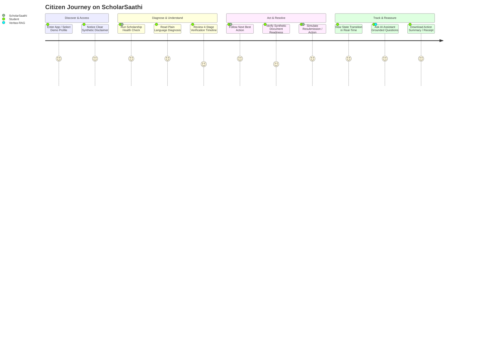

# ScholarSaathi — Product Requirements Document (PRD)
**Version:** 1.0.0-PROD-SPEC  
**Hackathon:** Build What Moves India (2026)  
**Track:** Citizen Guidance & Public Digital Services  
**Author:** Product Strategy, UX Architecture & Solutions Analysis Team  
**Status:** Approved Product Baseline (Pre-Implementation)

---

## 1. Executive Summary
ScholarSaathi is a citizen-first scholarship journey assistant engineered for Indian students navigating the complex, often opaque scholarship lifecycle. Millions of students across India apply for Central Sector, Post-Matric, Merit-cum-Means, and State scholarship schemes via portals such as the National Scholarship Portal (NSP) and State portals. However, once an application is submitted, students are confronted with cryptic status codes (e.g., *"Defective by INO"*, *"Pending at SNO"*, *"NPCI Mapping Inactive"*, *"PFMS Validation Pending"*), arbitrary delays, or silent rejections without actionable remediation steps.

ScholarSaathi does not attempt to replace government portals or act as an ungrounded chatbot. Instead, it acts as an **Actionable Guidance & Diagnosis Layer** that ingests application states, diagnoses bottlenecks across verification and disbursement stages, explains what is happening in plain bilingual/vernacular language, guides the citizen through corrective micro-actions, and tracks progress. For the hackathon prototype, all government backends, Aadhaar/NPCI states, and institutional databases are modeled safely using high-fidelity synthetic data and deterministic state machines, powered by an AI reasoning & grounded retrieval foundation (Veritas-RAG).

---

## 2. Product Vision
**"No Indian student should forfeit their rightful educational funding due to bureaucratic opacity, technical jargon, or unguided verification bottlenecks."**

ScholarSaathi transforms the citizen scholarship experience from a passive, anxiety-ridden waiting game into an empowering, transparent 5-step journey:  
$$\text{UNDERSTAND} \longrightarrow \text{DIAGNOSE} \longrightarrow \text{EXPLAIN} \longrightarrow \text{ACT} \longrightarrow \text{TRACK}$$

---

## 3. Problem Statement
Public scholarship portals in India solve the *intake* problem (submitting forms and uploading PDFs digitally), but they fail catastrophically at the *journey & resolution* problem:
1. **Cryptic Status Semantics:** Statuses like *"Application Defective"* versus *"Application Rejected"* create panic because students cannot distinguish between a temporary fixable discrepancy and a terminal rejection.
2. **Invisible Multi-Tiered Verification:** Verification involves four discrete authorities (Institute Nodal Officer $\rightarrow$ District Nodal Officer $\rightarrow$ State Nodal Officer $\rightarrow$ Ministry/PFMS). When stuck, students do not know which desk holds their file or what standard operating procedure (SOP) applies.
3. **The Silent Banking Trap:** Scholarships processed through the Public Financial Management System (PFMS) / Direct Benefit Transfer (DBT) fail when an Aadhaar number is linked to a bank account for SMS alerts but **not mapped/seeded on the NPCI mapper** for Aadhaar Enabled Payment System (AePS) transfers. Portals show *"Bank Account Validation Failed"* without explaining the difference between account-linking and NPCI-seeding.
4. **Disjointed Correction Windows:** Portals open brief "defect correction windows" with strict deadlines, but give zero actionable instructions on what document page is missing or which stamp/signature was rejected.
5. **Helpless Escalation:** When applications stall for months, students have no structured way to draft an inquiry, contact their Institute Nodal Officer, or lodge a CPGRAMS grievance with correct regulatory references.

---

## 4. Problem Context & Ecosystem Analysis
The Indian scholarship ecosystem serves over 30 million students annually across:
- **Central Schemes:** Ministry of Minority Affairs (MOMA), Ministry of Social Justice and Empowerment (MoSJE), Ministry of Tribal Affairs (MoTA), Department of Higher Education (DHE).
- **Disbursement Infrastructure:** PFMS (Public Financial Management System), DBT (Direct Benefit Transfer), NPCI (National Payments Corporation of India) Aadhaar Payment Bridge (APB).
- **Verification Hierarchies:**
  - **INO (Institute Nodal Officer):** Verifies student bonafide, course fee, attendance, and roll number.
  - **DNO (District Nodal Officer):** Verifies community/caste certificates, school recognition, and district quotas.
  - **SNO (State Nodal Officer):** Verifies state domicile, budget allocation, and state quota approvals.
  - **Ministry / PFMS Desk:** Runs deduplication, merit list ranking, Aadhaar-NPCI validation, sanction order generation, and fund disbursement.

---

## 5. Target Users
1. **First-Generation College Students:** High academic aspiration, limited familial experience navigating institutional bureaucracies.
2. **Tier-2 / Tier-3 / Rural Students:** Accessing services on budget Android smartphones, low-bandwidth 3G/4G connections, frequently using Cyber Cafes / Common Service Centres (CSCs).
3. **Parents & Community Mentors:** Non-technical guardians seeking clarity on their ward's education financial aid.
4. **College Student Union / Welfare Reps:** Guiding peers who have received defect notices or bank account errors.

---

## 6. Primary User Persona
- **Name:** Priya Sharma (Age: 19, B.Sc. 2nd Year, Govt Degree College, Alwar, Rajasthan)
- **Background:** First in her family to attend college. Eligible for Post-Matric Scholarship for EWS/OBC.
- **Context:** Submitted scholarship 45 days ago. Received an SMS: *"Application marked DEFECTIVE by INO."*
- **Emotional State:** Severe anxiety, fear of losing ₹25,000 tuition grant, unable to reach college clerk who is on leave.
- **Needs:** Immediate translation of the SMS, clear diagnosis of what document is defective, exact steps to upload the right bonafide format, and confidence that her application will not be cancelled.

---

## 7. Secondary Personas
- **Persona 2 (The Banking Trapped Student):** *Rahul Kumar (21, B.Tech, Bihar)* — Application approved by SNO, but PFMS status shows *"Payment Failed: Aadhaar Not Mapped to NPCI"*. Rahul has an active SBI savings account and doesn't know why DBT failed.
- **Persona 3 (The Multi-Scheme Applicant):** *Fatima Begum (18, Class 12, Hyderabad)* — Applied for Merit-cum-Means; needs to know if her Income Certificate validity (issued March 2024) expired before state verification.

---

## 8. User Pain Points Matrix

| Stage | Citizen Pain Point | Root Cause in Current Portals | ScholarSaathi Solution |
| :--- | :--- | :--- | :--- |
| **Verification** | Application stuck at "Pending at INO" for 30+ days | No SLA transparency; no student reminder tool | Automated Health Check flags stall duration; provides pre-filled INO Inquiry Memo |
| **Defect / Reject** | Received "Document Invalid" notification | Portals don't specify *which* field failed (e.g., Seal missing vs Expiry) | Document Mismatch Inspector highlights specific flaw with side-by-side visual checklist |
| **Banking / DBT** | "Payment Rejected by PFMS" | Conflation between Bank-Aadhaar Linking and NPCI Mapping | NPCI Status Diagnostic + Step-by-step Bank Mandate Letter generator |
| **Status Jargon** | "Marked as Defective" | Jargon sounds like permanent rejection | Plain-Language Translator: *"Good news: not rejected. Fixable before Dec 15."* |
| **Grievance** | Application forgotten after deadline passes | CPGRAMS portal is separate and intimidating | 1-Click Structured Citizen Escalation Packet with timestamps and tracking ID |

---

## 9. Current Experience vs. Proposed Experience

```
CURRENT CITIZEN EXPERIENCE:
[SMS: Status 402/Defective] 
    └──> [Panic / Confusion] 
             └──> [Visit Cyber Cafe / Wait in Line] 
                      └──> [Vague instructions from clerk] 
                               └──> [Missed deadline / Scholarship Cancelled]

PROPOSED SCHOLARSAATHI EXPERIENCE:
[Check Status / Input ID] 
    └──> [Scholarship Health Check: 82% Healthy (1 Action Required)]
             └──> [Plain-Language Breakdown: "Your College Needs Updated Bonafide Seal"]
                      └──> [Guided Correction: Download Template -> Inspect Upload -> Resubmit Simulation]
                               └──> [Instant Timeline Update: Application Moved to Re-Verification]
```

---

## 10. Product Goals
1. **Zero Jargon:** 100% of synthetic status codes translated into plain Hindi/English with clear emotional reassurance.
2. **Instant Actionability:** Every diagnosed status must produce exactly **one** unambiguous "Next Best Action".
3. **Radical Transparency:** Clear visual separation of multi-tier verification milestones (INO $\rightarrow$ DNO $\rightarrow$ SNO $\rightarrow$ PFMS).
4. **Reliable AI Assistance:** AI assistant responses must be strictly grounded in verified scholarship guidelines (via Veritas-RAG) with zero hallucination of government policies.
5. **Zero Citizen Risk:** Strict synthetic sandbox; clear disclosures that ScholarSaathi is an independent citizen guide and not an official government portal.

---

## 11. Non-Goals (Strict Boundaries)
- **NOT** a tool to submit real-world applications to live government servers (no reverse engineering, no scraping, no credential harvesting).
- **NOT** an unrestricted general LLM chatbot for homework, politics, or unrelated topics.
- **NOT** an automated approval bypass system (we cannot approve scholarships; we guide citizens to meet official criteria).
- **NOT** a financial transaction platform (no real money or OTP collection).

---

## 12. Core Product Principles
1. **Empathy First:** Respect the student's anxiety; provide clarity before technical detail.
2. **Action-Oriented:** Never show a problem without a clear, executable solution.
3. **Truth & Grounding:** If official policy is uncertain or dependent on state discretion, state the bounds honestly.
4. **Progressive Disclosure:** Simple summary cards on top; expandable bureaucratic audit trails beneath.
5. **High Accessibility:** Designed for single-hand mobile usage, low-contrast sunlight visibility, and low data footprints.

---

## 13. Value Proposition
- **For Students:** Clarity, saved travel expenses to nodal offices, prevented scholarship cancellations, reduced stress.
- **For Educational Institutions:** Reduced footfall of confused students inquiring about routine verification states.
- **For Public Administration:** Demonstrates how public digital services can achieve high trust and completion rates through thoughtful UX and grounded citizen guidance.

---

## 14. Primary Use Case: The Stalled Verification & Defect Resolution Journey
- **Trigger:** Student inputs Application ID or selects a demo profile with status *"Defective at INO"*.
- **Journey:**
  1. ScholarSaathi executes **Scholarship Health Check**.
  2. Status Translator converts "Defective" to *"Action Required: Bonafide Certificate Re-upload"*.
  3. Next Action Engine generates a 3-step action card:
     - Download prescribed Institute Bonafide Form (pre-filled).
     - Inspect document via Document Readiness Checker.
     - Simulate corrected resubmission.
  4. System transitions state to *"Re-submitted — Awaiting INO Re-verification"* and updates tracking timeline.

---

## 15. Secondary Use Cases
1. **The Aadhaar-NPCI Bank Disconnect:** Diagnosing why a bank account passed initial entry but failed PFMS DBT credit; providing the exact Form for Bank Manager submission.
2. **The Stalled DNO Escalation:** Application pending at District Nodal Officer for 45+ days (> SLA limit); generating a polite, formal RTI/Inquiry draft and DNO office contact protocol.
3. **Income Certificate Expiry Warning:** Warning the student that their state income certificate expires prior to the final SNO sanction round.
4. **Merit Cutoff & Sanction Tracking:** Tracking payment generation, FTO (Fund Transfer Order) generation, and credit confirmation.

---

## 16. Complete Citizen Journey Map



---

## 17. Functional Requirements Matrix

| ID | Module | Functional Requirement | Priority |
| :--- | :--- | :--- | :--- |
| **FR-01** | Demo Sandbox | User can switch between 4+ curated synthetic student profiles illustrating distinct real-world failure modes. | **P0** |
| **FR-02** | Health Check | System computes a numerical Health Score (0-100) and categorical risk level (Healthy, Warning, Action Needed, Critical). | **P0** |
| **FR-03** | Status Translator | System translates raw portal state strings into plain English & Hindi with "What it means" and "What you should do". | **P0** |
| **FR-04** | Timeline Tracker | Multi-tier visual timeline rendering INO, DNO, SNO, and PFMS milestones with explicit current owner desk. | **P0** |
| **FR-05** | Next Action Engine | Evaluates application state, defect flags, and days elapsed to render exactly ONE primary high-priority action card. | **P0** |
| **FR-06** | Guided Correction Flow | Interactive workflow allowing users to upload/replace synthetic documents and resolve defect flags. | **P0** |
| **FR-07** | State Transition Engine| Deterministic simulation updating application state upon successful user action (e.g., DEFECTIVE $\rightarrow$ RE_SUBMITTED). | **P0** |
| **FR-08** | Veritas-RAG AI | Citizen AI assistant responding to natural language questions with strict grounding, source citations, and confidence tags. | **P0** |
| **FR-09** | Bank/NPCI Diagnostic | Specialized diagnostic tool for Aadhaar-bank account seeding vs. NPCI mapper status. | **P1** |
| **FR-10** | Escalation Generator | Generates formal, pre-filled inquiry letters and CPGRAMS grievance drafts for SLA-breached applications. | **P1** |
| **FR-11** | Bilingual Toggle | Instant full-UI toggle between English and Hindi. | **P0** |
| **FR-12** | Action Receipt Export | Generates a lightweight downloadable summary (PDF/print-friendly) of resolved actions and next milestone dates. | **P1** |

---

## 18. AI & Veritas-RAG Requirements
- **Architecture:** Hybrid retrieval over an authoritative Indian Scholarship Policy & FAQ knowledge base (NSP guidelines, PFMS manual, state circulars).
- **Guardrails:**
  - Mandatory confidence threshold (>0.75).
  - Explicit citations to official scheme guidelines (e.g., *"Ref: Central Sector Scheme Guidelines 2024-25, Clause 4.2"*).
  - Strict fallback: If question falls outside scholarship domain or is ambiguous, prompt the citizen for clarification rather than guessing.
  - Refusal to predict non-deterministic outcomes (e.g., *"Will I definitely get the scholarship?"* $\rightarrow$ Explains merit quota calculation rules instead of false promises).

---

## 19. Mock Government-System & Data Requirements
- **No Live API Calls:** Zero connections to `scholarships.gov.in`, UIDAI, PFMS, or state portals.
- **Synthetic Schema Fidelity:** Mock data structures must faithfully replicate real portal payloads (Application IDs like `RJ202425008912`, INO Codes, PFMS Transaction Tokens, UTR numbers).
- **Explicit Disclaimers:** Persistent header/footer badge: *"PROTOTYPE SIMULATION — Uses Synthetic Data for Citizen Education. Not affiliated with Government of India."*

---

## 20. Accessibility, Mobile & Low-Connectivity Requirements
- **Mobile-First Responsive Layout:** Tested for 360px viewport widths (budget Android devices).
- **Touch Targets:** Minimum 48x48px hit areas for all buttons and interactive controls.
- **High Contrast:** Compliant with WCAG 2.1 AA (minimum 4.5:1 text-to-background contrast).
- **Bandwidth Efficiency:** Zero heavy video/3D assets; SVG icons; aggressive local state caching for offline-resilient UI rendering.

---

## 21. Acceptance Criteria & Success Metrics
- **Clarity Metric:** >90% of user testing respondents understand their synthetic status within 15 seconds of viewing the dashboard.
- **Action Completion:** 100% of demo scenarios can be successfully navigated from problem detection to simulated resolution in < 3 minutes.
- **AI Reliability:** Zero hallucinated policy numbers; 100% citation grounding on all Veritas-RAG generated responses.
- **Hackathon Compliance:** 100% alignment with Build What Moves India ethical and technical criteria.

---
*End of PRD. Proceed to PPD and Product Blueprint.*
