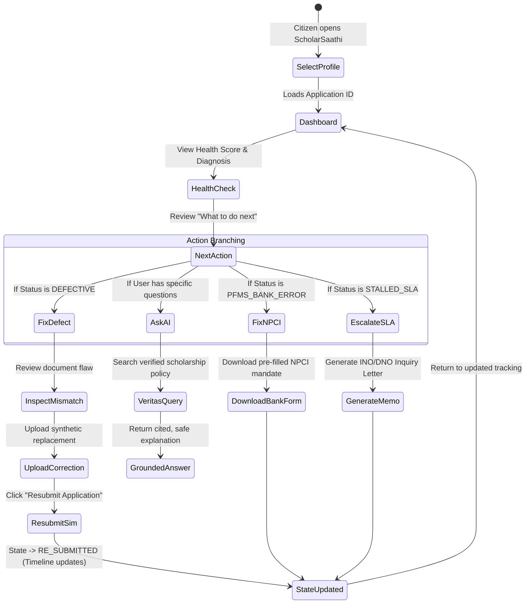
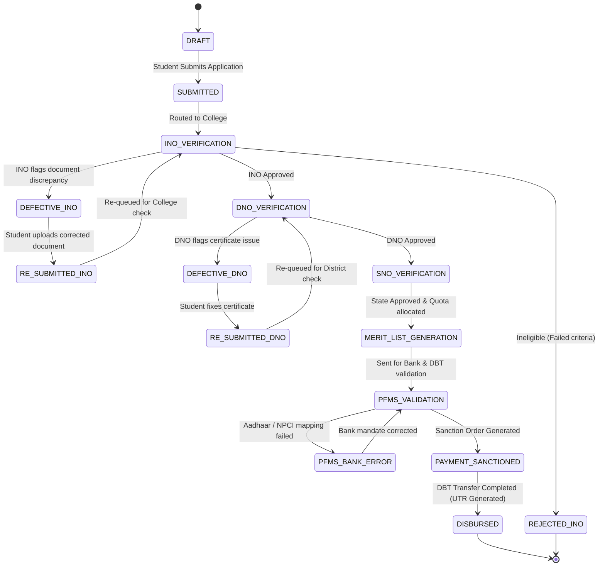

# ScholarSaathi — Product Blueprint & Master Specification
**Document Type:** Master Product Specification & Architecture Blueprint  
**Hackathon:** Build What Moves India (2026)  
**Track:** Citizen Guidance & Public Digital Services  
**Author:** Lead Product Strategist, UX Architect & Solution Analyst  
**Status:** Approved Master Blueprint

---

# A. Product Identity

| Attribute | Specification |
| :--- | :--- |
| **Official Name** | **ScholarSaathi** (स्कॉलर साथी) |
| **Alternative Names Considered** | VidyaSetu, NyayaScholar, MitraScholar, Margdarshak |
| **Tagline** | *"From 'Why is my scholarship stuck?' to 'I know exactly what to do next.'"* |
| **One-Line Description** | A citizen-first scholarship journey and diagnosis assistant that transforms opaque Indian government scholarship statuses into clear, actionable steps. |
| **Short Description** | ScholarSaathi empowers Indian students navigating complex scholarship portals (NSP, State portals, PFMS) by translating cryptic verification statuses, diagnosing delays, pinpointing document defects, and providing grounded, step-by-step guidance to secure their financial aid. |
| **Elevator Pitch** | Every year, thousands of Indian students lose critical college scholarships not because they are ineligible, but because their applications get stalled by opaque statuses like "Defective by INO" or "NPCI Mapping Inactive". ScholarSaathi is an empathetic, AI-grounded citizen guide that ingests synthetic scholarship states, runs an instant health audit, translates bureaucratic jargon into plain Hindi and English, and prescribes the exact single action needed to get the application unstuck. |

---

# B. Feature Architecture

```
+---------------------------------------------------------------------------------------+
|                                SCHOLARSAATHI PLATFORM                                 |
+---------------------------------------------------------------------------------------+
|  [1. Citizen Onboarding & Demo Sandbox]    [2. Bilingual Experience (EN / HI)]        |
|  - Synthetic Student Persona Selector       - Instant Full-UI Toggle                  |
|  - Application ID Lookup Simulation         - Plain Vernacular Tone                   |
+---------------------------------------------------------------------------------------+
|  [3. Diagnostic & Translation Layer]                                                  |
|  - Scholarship Health Check (0-100 Score & Risk Badge)                                |
|  - Plain-Language Status Translator (What It Means / Why It Happened)                 |
|  - Multi-Tier Verification Timeline (INO -> DNO -> SNO -> PFMS)                       |
+---------------------------------------------------------------------------------------+
|  [4. Next Action & Resolution Engine]                                                 |
|  - Single Next Best Action Card                                                       |
|  - Document Readiness & Mismatch Inspector                                            |
|  - Bank Account & NPCI Seeding Diagnostic Tool                                        |
|  - Guided Correction & Resubmission Simulator                                         |
|  - 1-Click Formal Escalation / Grievance Memo Generator                               |
+---------------------------------------------------------------------------------------+
|  [5. Grounded AI Citizen Assistant (Veritas-RAG Foundation)]                          |
|  - Policy-Grounded Natural Language Q&A                                               |
|  - Explicit Clause Citations & Scheme Rule Verification                                |
|  - Ambiguity Clarification & Hallucination Guardrails                                 |
+---------------------------------------------------------------------------------------+
```

### Detailed Feature Specifications

#### 1. Synthetic Persona & Application Selector
- **Purpose:** Enables judges and users to instantly load realistic student scenarios representing diverse failure modes without needing real credentials.
- **Inputs:** Dropdown selection or manual entry of synthetic Application ID (e.g., `RJ2024-DEF-8912`).
- **Outputs:** Populated student profile, application metadata, status timeline, and defect records.
- **AI Required:** No.
- **Backend State Required:** Yes (In-memory synthetic state store).
- **Scope:** **P0 (MVP Core)**.

#### 2. Scholarship Health Check Engine
- **Purpose:** Proactively audits the application's overall viability, checking document expiration, SLA stall durations, and verification progress.
- **Inputs:** Application creation date, current verification tier, last updated timestamp, document statuses, bank validation flags.
- **Outputs:** 0–100 Health Score, Status Category (`Healthy`, `Attention Needed`, `Action Required`, `Critical Risk`), and Diagnostic Warning Pills.
- **AI Required:** No (Deterministic rule engine for maximum speed and trust).
- **Backend State Required:** Yes.
- **Scope:** **P0 (MVP Core)**.

#### 3. Plain-Language Status Translator
- **Purpose:** Converts raw government codes (e.g., `APP_DEFECTIVE_INO_SEAL_MISSING`) into empathetic, plain-language explanations in English & Hindi.
- **Inputs:** Status Code, Rejection/Defect Reason String, Scheme Type.
- **Outputs:** Citizen-friendly Title, "What This Means" paragraph, "Is Your Money Safe?" reassurance indicator, "Action Required" indicator.
- **AI Required:** No (Deterministic translation dictionary supplemented with Veritas-RAG for deep inquiries).
- **Backend State Required:** Yes.
- **Scope:** **P0 (MVP Core)**.

#### 4. Multi-Tier Visual Timeline
- **Purpose:** Renders the 4-tier verification journey (Institute $\rightarrow$ District $\rightarrow$ State $\rightarrow$ PFMS/Disbursement), visually highlighting the current holding desk.
- **Inputs:** Verification history log with timestamps and officer designations.
- **Outputs:** Step-by-step graphical progress tracker showing completed, active (pulsing), and upcoming stages with SLA indicators.
- **AI Required:** No.
- **Backend State Required:** Yes.
- **Scope:** **P0 (MVP Core)**.

#### 5. Next Action Engine
- **Purpose:** Solves choice paralysis by dynamically rendering exactly **ONE** primary, high-priority action card.
- **Inputs:** Application health state, active defect codes, SLA elapsed days.
- **Outputs:** Action Card containing Action Title, Estimated Time to Complete, Step-by-Step Instructions, and Primary Action Button (e.g., *"Upload Corrected Bonafide"*, *"Generate Bank NPCI Form"*).
- **AI Required:** No (Rule-based decision tree).
- **Backend State Required:** Yes.
- **Scope:** **P0 (MVP Core)**.

#### 6. Document Readiness & Mismatch Inspector
- **Purpose:** Shows side-by-side comparison of the defective uploaded document versus the required official standard (e.g., missing principal signature, missing official stamp, wrong financial year).
- **Inputs:** Synthetic document object containing flagged defect coordinates/reasons.
- **Outputs:** Visual inspection card with defect callouts, required checklist, and file replacement button.
- **AI Required:** No (Simulated inspection in UI for speed and predictability).
- **Backend State Required:** Yes.
- **Scope:** **P0 (MVP Core)**.

#### 7. Bank Account & NPCI Seeding Diagnostic
- **Purpose:** Demystifies the common failure where a student's bank account is linked to Aadhaar for SMS but not seeded with NPCI for DBT scholarship transfers.
- **Inputs:** Bank verification status code (`PFMS_ERR_NPCI_INACTIVE`).
- **Outputs:** Plain diagnostic explanation, Aadhaar-NPCI status indicator, and downloadable pre-filled Bank Mandate Submission Letter for the student's branch manager.
- **AI Required:** No.
- **Backend State Required:** Yes.
- **Scope:** **P1 (High-Value Feature)**.

#### 8. Guided Correction & Resubmission Simulator
- **Purpose:** Allows the student to upload/replace synthetic documents, confirm checklist items, and simulate submitting the correction back to the Nodal Officer.
- **Inputs:** User interaction (checkbox toggles, synthetic file upload trigger).
- **Outputs:** Real-time state transition (`DEFECTIVE` $\rightarrow$ `RE_SUBMITTED`), visual celebration toast, and updated timeline.
- **AI Required:** No.
- **Backend State Required:** Yes (Updates synthetic application state).
- **Scope:** **P0 (MVP Core)**.

#### 9. Grounded AI Citizen Assistant (Veritas-RAG Powered)
- **Purpose:** Answers contextual scholarship questions in natural language with strict grounding in official scheme rules and zero hallucinations.
- **Inputs:** User text prompt, current application context.
- **Outputs:** Grounded conversational response, official policy citations (clause/guideline), and confidence level badge.
- **AI Required:** Yes (OpenAI LLM + Veritas-RAG Retrieval & Reflection Pipeline).
- **Backend State Required:** Yes.
- **Scope:** **P0 (MVP Core)**.

#### 10. Formal Escalation & Inquiry Memo Generator
- **Purpose:** Generates a structured, respectful, and legally sound inquiry letter or CPGRAMS grievance text when an application is stuck past the official SLA (e.g., >30 days at DNO).
- **Inputs:** Student Name, Application ID, Scheme Name, Days Delayed, Current Desk.
- **Outputs:** Copyable / Printable formal letter with official subject line and policy SLA citations.
- **AI Required:** Optional (Template-based with AI personalization).
- **Backend State Required:** Yes.
- **Scope:** **P1 (High-Value Feature)**.

---

# C. Full Citizen Workflows



### Detailed Workflow Matrix

1. **First-Time User:** Arrives at landing page $\rightarrow$ Sees clear "Citizen Scholarship Guide" value prop $\rightarrow$ Selects a demo persona or enters Application ID $\rightarrow$ Instantly lands on diagnostic dashboard.
2. **Track Application:** User views the 4-tier timeline $\rightarrow$ Identifies exact desk (e.g., DNO Jaipur) $\rightarrow$ Sees estimated completion date based on SLA.
3. **Stuck / Delayed Application (>30 days at DNO):** Health Check score drops to 55 (Warning) $\rightarrow$ Status Translator explains DNO backlog $\rightarrow$ Next Action suggests generating an official inquiry memo.
4. **Defective Application (Bonafide Seal Missing):** Health Check shows "Action Required (42/100)" $\rightarrow$ Document Inspector highlights missing stamp $\rightarrow$ User uploads corrected bonafide $\rightarrow$ State transitions to `RE_SUBMITTED`.
5. **NPCI / Bank Account Disconnect:** PFMS flag detected $\rightarrow$ Explains why bank account works for ATM but fails for DBT $\rightarrow$ Generates pre-filled NPCI seeding request letter for bank branch.
6. **Rejected Application (Income Over Limit):** Plain translator explains why threshold was exceeded $\rightarrow$ Directs student to alternative State or Private scholarships with higher income ceilings.
7. **Approved & Payment Pending:** Displays sanction order generation milestone $\rightarrow$ Explains FTO (Fund Transfer Order) timeline $\rightarrow$ Reassures student that disbursement occurs in batches.
8. **AI Clarification Flow:** Student asks *"Can I get both Post-Matric and Merit scholarship?"* $\rightarrow$ Veritas-RAG checks dual-scholarship clause $\rightarrow$ Answers that government rules permit only one central scholarship, but private grants are allowed.

---

# D. Application State Machine



### Comprehensive State Definitions

| State Code | Category | Plain Language Label (EN) | Plain Language Label (HI) | SLA (Days) | Next Action Key |
| :--- | :--- | :--- | :--- | :--- | :--- |
| `DRAFT` | Initial | Application Not Submitted | आवेदन जमा नहीं किया गया | - | `ACTION_SUBMIT` |
| `SUBMITTED` | In-Review | Successfully Submitted | सफलतापूर्वक जमा किया गया | 7 | `ACTION_WAIT_INO` |
| `INO_VERIFICATION` | In-Review | Under College Verification | कॉलेज सत्यापन जारी | 15 | `ACTION_TRACK_INO` |
| `DEFECTIVE_INO` | Action Required | Defect Marked by College | कॉलेज द्वारा त्रुटि दर्ज | 14 | `ACTION_FIX_BONAFIDE` |
| `RE_SUBMITTED_INO` | In-Review | Correction Submitted to College | कॉलेज को संशोधित फॉर्म भेजा | 7 | `ACTION_WAIT_RECHECK` |
| `DNO_VERIFICATION` | In-Review | Under District Welfare Review | जिला कल्याण अधिकारी समीक्षा जारी | 20 | `ACTION_TRACK_DNO` |
| `STALLED_DNO` | Warning | Verification Delayed at District | जिला स्तर पर सत्यापन रुका हुआ | 30+ | `ACTION_ESCALATE_DNO` |
| `SNO_VERIFICATION` | In-Review | Under State Nodal Review | राज्य स्तर पर अंतिम अनुमोदन जारी | 15 | `ACTION_TRACK_SNO` |
| `PFMS_VALIDATION` | In-Review | Bank Account Validation in Progress | बैंक खाता सत्यापन जारी | 7 | `ACTION_CHECK_NPCI` |
| `PFMS_BANK_ERROR` | Action Required | DBT Payment Failed: NPCI Inactive | भुगतान विफल: NPCI लिंक नहीं है | 10 | `ACTION_FIX_NPCI` |
| `PAYMENT_SANCTIONED` | Positive | Scholarship Sanctioned | छात्रवृत्ति स्वीकृत | 5 | `ACTION_TRACK_DISBURSE`|
| `DISBURSED` | Completed | Money Credited to Bank Account | बैंक खाते में राशि जमा हो चुकी है | 0 | `ACTION_COMPLETED` |
| `REJECTED_FINAL` | Terminal | Application Rejected | आवेदन अस्वीकृत | 0 | `ACTION_EXPLORE_ALT` |

---

# E. Scholarship Health Check Engine

The Health Check provides an instant, objective numerical assessment of the application's standing:

$$\text{Health Score} = 100 - \sum (\text{Defect Penalties}) - \sum (\text{SLA Delay Penalties}) - \sum (\text{Banking Risk Penalties})$$

### Health Scoring Matrix

| Condition | Penalty Points | Risk Category | Visual Badge |
| :--- | :--- | :--- | :--- |
| Active Document Defect (`DEFECTIVE_INO` / `DEFECTIVE_DNO`) | -40 pts | Action Required | Orange Warning Badge |
| Bank / NPCI Validation Failed (`PFMS_BANK_ERROR`) | -50 pts | Critical Action Required | Red Danger Badge |
| Verification Delayed > 1.5x Official SLA | -20 pts | Attention Needed | Yellow Caution Badge |
| Verification Delayed > 2.5x Official SLA | -35 pts | Stalled Application | Yellow Caution Badge |
| Income / Domicile Certificate Expiring in < 30 Days | -15 pts | Upcoming Risk | Blue Info Badge |
| All Verifications on Track & Within SLA | 0 pts | Healthy | Green Shield Badge |

### Health Status Bands
- **85 – 100:** `HEALTHY` — Application moving normally through bureaucratic stages.
- **65 – 84:** `ATTENTION_NEEDED` — Minor delay or impending document expiration.
- **30 – 64:** `ACTION_REQUIRED` — Defect notice active; requires immediate student intervention.
- **0 – 29:** `CRITICAL_RISK` — Payment failure or terminal rejection risk without immediate action.

---

# F. Status Translator (Dictionary & Semantic Mapping)

```
[Raw Gov String] --------> [Translator Engine] --------> [Empathetic Citizen Card]
"DEFECTIVE_INO_SEAL_09"                                 "Don't worry! Your scholarship is NOT rejected.
                                                         Your college clerk noticed that the uploaded
                                                         Bonafide Certificate is missing the Principal's
                                                         official stamp. You have 12 days to re-upload."
```

### Translator Dictionary Excerpts

| Raw System Status | Citizen Summary (English) | Citizen Summary (Hindi) | Reassurance Flag |
| :--- | :--- | :--- | :--- |
| `DEFECTIVE_INO` | **Action Needed: Document Correction**<br>Your college needs you to re-upload one document before they can approve. | **कार्रवाई आवश्यक: दस्तावेज़ सुधार**<br>कॉलेज को आगे बढ़ाने के लिए एक दस्तावेज़ दोबारा अपलोड करना होगा। | *"Your application is safe. This is a normal correction request."* |
| `PENDING_DNO_SLA_BREACH` | **Verification Delayed at District Level**<br>Your file has been at the District Welfare Office longer than the typical 20 days. | **जिला स्तर पर देरी**<br>आपकी फ़ाइल सामान्य 20 दिनों से अधिक समय से जिला कार्यालय में लंबित है। | *"Your eligibility is intact. We can help you send a formal status inquiry."* |
| `PFMS_NPCI_INACTIVE` | **Bank Account Issue: DBT Inactive**<br>Your scholarship is approved, but the bank cannot deposit the money because your Aadhaar is not active on the NPCI mapper. | **बैंक खाता समस्या: DBT निष्क्रिय**<br>छात्रवृत्ति स्वीकृत है, लेकिन बैंक में राशि भेजने के लिए आधार NPCI से लिंक नहीं है। | *"Your money is reserved. Submitting an NPCI mandate to your bank branch will fix this."* |
| `SANCTIONED_BATCH_WAIT` | **Scholarship Approved! Funds in Queue**<br>Your sanction order has been generated. Payment will be credited in the next ministry disbursement cycle. | **छात्रवृत्ति स्वीकृत! भुगतान प्रक्रिया में**<br>स्वीकृति आदेश जारी हो चुका है। अगले चक्र में राशि आपके खाते में आ जाएगी। | *"Congratulations! No further action is required from your side."* |

---

# G. Document Readiness & Mismatch Inspector

### Synthetic Document Types Supported
1. **Institute Bonafide Certificate:** Validates current enrollment, course year, roll number, and institution seal.
2. **Family Income Certificate:** Validates annual income threshold ($\le$ ₹2.5 Lakh or ₹8.0 Lakh depending on scheme) and issuing tehsildar authority.
3. **Caste / Community Certificate:** Validates category reservation credentials and state digital certificate barcode.
4. **Previous Year Marksheet:** Validates minimum qualifying score (e.g., $\ge$ 50% or 60%).
5. **Fee Receipt:** Validates reimbursement claim amount.

### Document Mismatch Scenarios in Prototype
- **Scenario A (Missing Seal):** Bonafide certificate uploaded without the college seal/stamp.
- **Scenario B (Expired Certificate):** Income certificate valid up to March 31, 2024, submitted for 2024-25 academic year.
- **Scenario C (Name Discrepancy):** Name on Marksheet (*"Priya Kumari"*) differs from Aadhaar (*"Priya Sharma"*).

---

# H. Rejection & Defect Resolution Engine

```
                                [DEFECT DETECTED]
                                        |
                 +----------------------+----------------------+
                 |                                             |
      [FIXABLE / DEFECTIVE]                                [TERMINAL REJECTION]
                 |                                             |
    - Missing Stamp/Sign                          - Family Income Exceeds Ceiling
    - Expired Document Format                     - Ineligible Course Category
    - Blurred / Unreadable Scan                   - Duplicate Application on Other Portal
                 |                                             |
       {Guided Correction Flow}                     {Alternative Scheme Finder}
       1. Download Standard Form                    1. Explain Ineligibility Clause
       2. Inspect Checkpoints                       2. Match Alternative State/CSR
       3. One-Click Resubmission Simulation         3. Guide Next Academic Cycle
```

---

# I. Next Action Engine (Decision Matrix)

The Next Action Engine evaluates the application state tree and selects the single highest-priority action:

```
IF Status == "DEFECTIVE_INO" OR Status == "DEFECTIVE_DNO":
    -> Action: "REVIEW_AND_FIX_DOCUMENT" (Priority 1)
ELSE IF Status == "PFMS_BANK_ERROR":
    -> Action: "RESOLVE_NPCI_MAPPING" (Priority 1)
ELSE IF Status == "DNO_VERIFICATION" AND DaysElapsed > 30:
    -> Action: "GENERATE_OFFICIAL_INQUIRY_MEMO" (Priority 2)
ELSE IF Status == "DRAFT":
    -> Action: "COMPLETE_FINAL_SUBMISSION" (Priority 1)
ELSE IF Status == "PAYMENT_SANCTIONED" OR Status == "DISBURSED":
    -> Action: "VIEW_PAYMENT_RECEIPT_AND_UTR" (Priority 3)
ELSE:
    -> Action: "NO_ACTION_REQUIRED_TRACK_STAGE" (Priority 4)
```

---

# J. Grounded AI Citizen Assistant (Veritas-RAG Powered)

### Supported Intents
- **Status Explanation:** *"Why is my status showing Pending at SNO?"*
- **Policy Inquiries:** *"What is the maximum family income limit for Central Sector Scheme?"*
- **Banking / DBT Guidance:** *"How do I check if my bank account is seeded with NPCI?"*
- **Document Requirements:** *"What documents are needed for fresh renewal?"*
- **Timeline & Disbursement:** *"When does the Ministry usually release scholarship payments?"*

### Unsupported / Guardrailed Intents
- **Approving Applications:** Refuses and clarifies that only designated Nodal Officers have approval authority.
- **Modifying Live Government Portals:** Refuses and explains that ScholarSaathi is an independent guidance layer.
- **Unrelated General Inquiries:** Politely redirects the conversation back to scholarship and financial aid topics.

### Grounding & Reliability Controls
- **Indexed Knowledge Base:** Central Sector Scheme Guidelines (2024-25), NSP FAQ 2024, PFMS DBT Manual, State Welfare SOPs.
- **Citation Format:** Every answer concludes with a verified source reference:  
  *`[Source: National Scholarship Portal User Manual 2024, Section 5.3: Defect Resolution]`*
- **Confidence Scoring:** Answers with retrieval confidence $<0.75$ trigger automatic clarification questions rather than speculative responses.

---

# K. Veritas-RAG Integration Architecture

```
                                [Citizen Natural Language Query]
                                               |
                                    [Query Intelligence]
                               - Intent Classification (Status/Rule/Action)
                               - Entity Extraction (Scheme, Category, State)
                                               |
                                     [Hybrid Retrieval]
                               - Dense Vector Embedding Search
                               - BM25 Keyword Search over Policy Corpus
                                               |
                                 [Retrieval Quality Check]
                                               |
                           +-------------------+-------------------+
                           | (Score >= 0.75)                       | (Score < 0.75)
                           v                                       v
                [Grounded Answer Generation]              [Clarification Request]
                - Ingests Top-3 Verified Chunks           - Asks user for Scheme
                - Enforces Zero-Hallucination Policy        or State specifics
                           |
                [Self-Reflection & Validation]
                - Checks factual consistency with policy
                - Appends official citations & confidence
                           |
                           v
                [Citizen Response Card]
```

---

# L. Mock Backend Data Models (Schemas)

### 1. Student Profile Model
```typescript
interface StudentProfile {
  id: string; // e.g. "STUDENT_001"
  name: string; // e.g. "Priya Sharma"
  gender: "FEMALE" | "MALE" | "OTHER";
  category: "OBC" | "SC" | "ST" | "GENERAL_EWS";
  annualFamilyIncome: number; // e.g. 180000 (INR)
  stateOfDomicile: string; // e.g. "Rajasthan"
  institution: {
    name: string; // e.g. "Govt. Degree College, Alwar"
    aisheCode: string; // e.g. "C-12345"
    course: string; // e.g. "B.Sc. Mathematics (Year 2)"
    rollNumber: string;
  };
  aadhaarLinked: boolean;
  npciMapped: boolean;
  bankAccount: {
    bankName: string;
    accountNumberMasked: string; // "XXXX-XXXX-4819"
    ifsc: string;
  };
}
```

### 2. Scholarship Application Model
```typescript
interface ScholarshipApplication {
  applicationId: string; // e.g. "RJ202425008912"
  schemeName: string; // e.g. "Post-Matric Scholarship for OBC Students"
  schemeType: "CENTRAL_SECTOR" | "STATE_POST_MATRIC" | "MERIT_CUM_MEANS";
  academicYear: "2024-2025";
  submissionDate: string; // ISO format
  lastUpdated: string; // ISO format
  status: ApplicationState; // Enumerated state
  healthScore: number; // 0 - 100
  currentDesk: "COLLEGE_INO" | "DISTRICT_DNO" | "STATE_SNO" | "PFMS_DBT" | "COMPLETED";
  slaDaysRemaining: number;
  defects: ApplicationDefect[];
  verificationHistory: VerificationMilestone[];
  disbursement: DisbursementRecord | null;
}
```

### 3. Application Defect Model
```typescript
interface ApplicationDefect {
  defectId: string;
  documentType: "BONAFIDE" | "INCOME_CERT" | "CASTE_CERT" | "MARKSHEET" | "BANK_MANDATE";
  flaggedBy: "COLLEGE_INO" | "DISTRICT_DNO" | "PFMS_SYSTEM";
  flaggedDate: string;
  officialReason: string; // e.g. "Institute seal missing on bonafide"
  plainExplanation: string; // "Your college principal's round stamp is missing."
  requiredAction: string; // "Re-upload bonafide with official stamp."
  isResolved: boolean;
  resolvedDate?: string;
}
```

---

# M. Realistic Synthetic Demo Scenarios

### Scenario 1: The Defective Bonafide (Hero Journey)
- **Student:** Priya Sharma (19, B.Sc. 2nd Year, Rajasthan)
- **Application ID:** `RJ202425008912`
- **Initial Status:** `DEFECTIVE_INO`
- **Root Problem:** College Nodal Officer marked application defective because the uploaded Bonafide certificate lacked the college's official circular seal.
- **Health Score:** 45/100 (`ACTION_REQUIRED`).
- **Interactive Journey:**
  1. Priya opens ScholarSaathi, loads her profile.
  2. Health Check flags 1 critical action required.
  3. Status Translator reassures her: *"Not rejected! Just needs an updated college stamp."*
  4. Mismatch Inspector shows side-by-side comparison of missing seal.
  5. Priya clicks "Upload Corrected Bonafide" and completes simulated resubmission.
  6. Application state transitions to `RE_SUBMITTED_INO`, Health Score jumps to 90/100.

### Scenario 2: The Silent Banking Trap (NPCI Mismatch)
- **Student:** Rahul Kumar (21, B.Tech 3rd Year, Bihar)
- **Application ID:** `BR202425014720`
- **Initial Status:** `PFMS_BANK_ERROR`
- **Root Problem:** Application approved by State Nodal Officer, but PFMS fund transfer failed because Rahul's SBI account is linked for Aadhaar KYC but not seeded on the NPCI mapper for DBT.
- **Health Score:** 25/100 (`CRITICAL_RISK`).
- **Interactive Journey:**
  1. Translator explains why ATM cards work while DBT payments fail.
  2. Next Action Engine generates a 1-click pre-filled NPCI Bank Mandate Form.
  3. Rahul clicks "Simulate Bank Mandate Submission".
  4. State transitions to `PFMS_VALIDATION`, preventing scholarship forfeiture.

### Scenario 3: The Stalled District Nodal Officer (SLA Breach)
- **Student:** Fatima Begum (18, Class 12, Telangana)
- **Application ID:** `TS202425003319`
- **Initial Status:** `STALLED_DNO` (42 days elapsed; official SLA is 20 days).
- **Root Problem:** Application sitting unverified in District Welfare Office queue.
- **Health Score:** 55/100 (`WARNING`).
- **Interactive Journey:**
  1. Translator explains that the application is safe but stuck in the district backlog.
  2. Next Action Engine generates a polite, formal Status Inquiry Memo citing DNO SLA guidelines.
  3. Fatima downloads the letter and logs a simulated inquiry tracking ticket.

### Scenario 4: The Golden Path (Sanctioned & Disbursed)
- **Student:** Amit Verma (20, B.Com 2nd Year, Uttar Pradesh)
- **Application ID:** `UP202425091844`
- **Initial Status:** `DISBURSED`
- **Root Problem:** None (Demonstrates successful state for comparison).
- **Health Score:** 100/100 (`HEALTHY`).
- **Interactive Journey:**
  1. Displays full green 4-stage timeline.
  2. Shows PFMS UTR credit confirmation, payment date, and downloadable financial aid summary.

---

# N. Screen Inventory & UX Architecture

```
+-----------------------------------------------------------------------------------------+
|                                    APP HEADER BAR                                       |
|  [Logo: ScholarSaathi स्कॉलर साथी]        [Demo Persona Dropdown]       [Lang: EN | HI] |
+-----------------------------------------------------------------------------------------+
|  [PERSISTENT BANNER: Prototype Simulation with Synthetic Data - Not Official Govt App] |
+-----------------------------------------------------------------------------------------+
|  MAIN DASHBOARD VIEW                                                                    |
|  +--------------------------------------------+  +-----------------------------------+  |
|  | 1. STUDENT SUMMARY CARD                    |  | 2. SCHOLARSHIP HEALTH CHECK       |  |
|  | Priya Sharma | B.Sc. Yr 2                  |  | Score: 45 / 100 [ACTION REQUIRED] |  |
|  | App ID: RJ202425008912 | Post-Matric OBC   |  | Breakdown: 1 Defect, 0 SLA Breaches| |
|  +--------------------------------------------+  +-----------------------------------+  |
|                                                                                         |
|  +-----------------------------------------------------------------------------------+  |
|  | 3. PLAIN LANGUAGE STATUS CARD                                                     |  |
|  | "Your College Marked a Document Defect" [Reassurance: Your Money is Safe]         |  |
|  | Explanation: The Principal's seal is missing on your Bonafide Certificate.        |  |
|  +-----------------------------------------------------------------------------------+  |
|                                                                                         |
|  +-----------------------------------------------------------------------------------+  |
|  | 4. MULTI-TIER JOURNEY TIMELINE                                                     |  |
|  | [1. Submitted] -> [2. College (ACTIVE DEFECT)] -> [3. District] -> [4. PFMS DBT]  |  |
|  +-----------------------------------------------------------------------------------+  |
|                                                                                         |
|  +-----------------------------------------------------------------------------------+  |
|  | 5. NEXT BEST ACTION (HERO ACTION CONTAINER)                                       |  |
|  | Title: Fix Your Bonafide Certificate (Deadline: Dec 15, 2024)                      |  |
|  | [Button: Open Document Inspector & Fix]                                           |  |
|  +-----------------------------------------------------------------------------------+  |
|                                                                                         |
|  +--------------------------------------------+  +-----------------------------------+  |
|  | 6. GROUNDED AI ASSISTANT WIDGET            |  | 7. ESCALATION & TOOLS DRAWER      |  |
|  | "Ask anything about your scholarship..."   |  | - NPCI Mandate Generator          |  |
|  | [Grounded responses with Scheme Citations] |  | - DNO Inquiry Letter Generator    |  |
|  +--------------------------------------------+  +-----------------------------------+  |
+-----------------------------------------------------------------------------------------+
```

### Screen Inventory Matrix

| Screen / Modal ID | Component Name | Key Elements & CTAs |
| :--- | :--- | :--- |
| **SCR-01** | **Main Diagnostic Dashboard** | Persona Selector, Health Scorecard, Status Translator Card, 4-Stage Timeline, Next Action Hero Card. |
| **SCR-02** | **Document Mismatch Inspector Modal** | Side-by-side flawed vs. valid document view, missing seal callout, "Upload Corrected Document" CTA. |
| **SCR-03** | **NPCI & Bank Diagnostic Modal** | Bank-Aadhaar vs NPCI explanation diagram, "Download Pre-Filled Bank Mandate" CTA, "Simulate NPCI Fix" CTA. |
| **SCR-04** | **SLA Escalation Memo Generator Modal** | Pre-filled formal inquiry letter to Nodal Officer, copy button, simulated tracking ticket confirmation. |
| **SCR-05** | **Grounded AI Assistant Drawer** | Conversational chat interface, suggestion chips (*"Why is it stuck?"*, *"What is INO?"*), citation cards, confidence tags. |
| **SCR-06** | **Action Confirmation / State Transition Toast** | Animated success notification confirming status update from `DEFECTIVE` to `RE_SUBMITTED`. |

---

# O. UX Principles & Accessibility Guidelines
1. **Plain Vernacular Framing:** Avoid jargon like "Aadhaar Seeding"; use *"Linking your bank account to receive government scholarship money."*
2. **Cognitive Load Reduction:** Never present more than one primary CTA on the main viewport.
3. **High Contrast for Outdoor Sunlight Use:** Background `#F8FAFC`, Primary `#1E3A8A` (Navy Blue), Accent `#D97706` (Warm Saffron), Success `#059669` (Emerald Green).
4. **Mobile Touch Target Standards:** All interactive elements $\ge$ 48px height with 12px finger padding.

---

# P. Notifications Engine (Simulation)
Synthetic notifications alert students to stage advancements:
- *"Good news! Your college has approved your re-submitted bonafide. File moved to District Officer."*
- *"Reminder: 4 days remaining to upload your corrected income certificate."*

---

# Q. Error Handling & Edge Cases
- **No Internet / Offline Fallback:** Graceful banner *"Working in Offline Mode. Cached diagnostic data available."*
- **Ambiguous Student Query in AI:** *"We found multiple rules for Post-Matric schemes in Rajasthan vs. Central. Which one is your application?"*

---

# R. Security, Privacy & Non-PII Guidelines
- Zero real citizen Aadhaar numbers or bank account numbers stored or accepted.
- Masked synthetic numbers only (e.g., `XXXXXXXX1234`).
- No live connections to government servers.

---

# S. Synthetic Data Governance Rules
- All demo profiles must be clearly watermarked as `SYNTHETIC_DATA_DEMO`.
- Data sets must reflect realistic Indian demographic diversity, regional representation, and actual state/central scheme nomenclatures.

---

# T. Hackathon Compliance Matrix

| "Build What Moves India" Rule | Compliance Evidence in ScholarSaathi |
| :--- | :--- |
| **Solve one clearly defined citizen problem** | Solves the post-submission comprehension and defect resolution bottleneck for Indian scholarships. |
| **Complete citizen journey** | End-to-end flow: Status intake $\rightarrow$ Health Check $\rightarrow$ Diagnosis $\rightarrow$ Correction $\rightarrow$ Resubmission $\rightarrow$ Updated Tracking. |
| **Easier than current experience** | Replaces multi-page PDF guidelines and cryptic codes with a 15-second visual diagnosis and 1-click action cards. |
| **Works for real Indian users** | Mobile-first, bilingual (English/Hindi), low data footprint, high accessibility. |
| **Safe synthetic mock backend** | 100% synthetic data models; zero live government scraping or security interference. |
| **Clear non-government disclosure** | Prominent persistent disclosure banners on all screens. |
| **Meaningful AI usage** | Veritas-RAG hybrid retrieval providing grounded policy citations with zero hallucinations. |

---

# Product Strategist Recommendations

### Critical Concept Analysis & Enhancements

| Recommendation Type | Feature / Concept | Priority | Strategic Rationale | Impact on Judging |
| :--- | :--- | :--- | :--- | :--- |
| **ADDITION** | **NPCI vs. Aadhaar Bank Diagnostic Tool** | **P1** | One of the most prevalent real-world failure modes in Indian DBT is that bank accounts are KYC-linked but not NPCI-seeded. Adding this diagnostic proves profound domain mastery. | **Massive Product Thinking & End-to-End Score Boost** |
| **ADDITION** | **Pre-Filled DNO / INO Inquiry Memo Generator** | **P1** | When applications are stuck due to administrative backlog (SLA breach), giving students an official, polite inquiry letter closes the loop. | **Turns a passive viewer into an empowered citizen** |
| **ADDITION** | **Side-by-Side Document Flaw Inspector** | **P0** | Rather than a generic file upload, showing *why* the synthetic document was rejected (e.g., missing seal) makes the demo immediately understandable to judges. | **High Visual Usability & Working Build Impact** |
| **MODIFICATION** | **Health Check as a Deterministic Engine (Not LLM)** | **P0** | Health scoring should be instant, predictable, and rule-based so judges see deterministic transitions when actions are completed. Veritas-RAG is reserved for natural language inquiries. | **Rock-solid reliability; prevents unexpected demo glitches** |
| **REMOVAL** | **Unrestricted General AI Chatbot** | **P0** | Remove any open-ended conversational capabilities that answer non-scholarship questions. The AI must remain strictly bounded to scholarship guidelines. | **Guarantees Honesty and Trust criteria** |

---

# Feature Prioritization (P0 / P1 / P2)

### P0 — Absolutely Required for Hackathon MVP
1. **Interactive Demo Persona Switcher** (4 diverse student failure modes).
2. **Scholarship Health Check Engine** (0-100 score + risk categorization).
3. **Plain-Language Status Translator** (English & Hindi empathetic breakdown).
4. **4-Tier Verification Journey Timeline** (Visual step tracker).
5. **Single Next Best Action Hero Card** (Dynamic priority action).
6. **Side-by-Side Document Mismatch Inspector** (Visual defect highlight).
7. **Interactive Guided Correction & Resubmission Simulator** (State transition to `RE_SUBMITTED`).
8. **Veritas-RAG Policy Assistant** (Grounded Q&A with scheme clause citations).
9. **Persistent Non-Government & Synthetic Data Disclaimers**.
10. **Bilingual Toggle (English / Hindi)**.

### P1 — High-Value if Time Permits
1. **Aadhaar-NPCI Bank Mandate Generator** (Downloadable pre-filled bank letter).
2. **Formal SLA Escalation / Inquiry Memo Generator** (Downloadable letter to DNO).
3. **Action Summary & Receipt Export** (Print/PDF summary of resolution).
4. **Audio Read-Aloud for Status Translation** (Voice accessibility for rural citizens).

### P2 — Future Enhancements
1. Multi-state vernacular support (Tamil, Telugu, Bengali, Marathi).
2. Integration with DigiLocker synthetic sandboxes.
3. Automated WhatsApp status update simulation.
4. College Nodal Officer administrative triage dashboard.

---
*End of Master Product Blueprint.*
